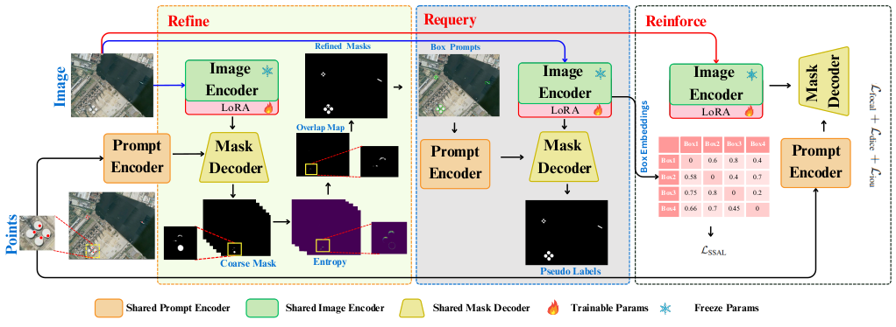

<div align="center">
    
# ReSAM: Refine, Requery, and Reinforce: Self-Prompting Point-Supervised Segmentation for Remote Sensing Images

[](https://arxiv.org/abs/2511.21606)
[](https://mnaseersubhani.github.io/resam_project_page/)
[](https://colab.research.google.com/drive/12RtZknvF2JwVtjWMW4MfyjE7buQSO9_x?usp=drive_link)
</div>


## 🚀 Latest Updates
- **20 Feb 2026** Accepted at CVPR 2026.
- **26 Nov 2025**: The arXiv version is released [here](https://arxiv.org/abs/2511.21606).
---


## 🖌️ Overview



## 🎮 Getting Started
### 1.Install Environment
> **Python 3.10**. Follow these steps to set up your environment:
```bash
conda create --name resam python=3.10
conda activate resam

pip install torch==2.7.0 torchvision==0.22.0 torchaudio==2.7.0 --index-url https://download.pytorch.org/whl/cu128
git clone https://github.com/MNaseerSubhani/ReSAM.git
cd resam
pip install -r requirements.txt
```


### 2.Prepare Dataset 

#### WHU Building Dataset

- Dataset download address: [WHU Building Dataset](https://aistudio.baidu.com/datasetdetail/56502)。

<!-- - For converting semantic label to instance label, you can refer to corresponding [conversion script](https://github.com/KyanChen/RSPrompter/blob/release/tools/rsprompter/whu2coco.py). -->

#### HRSID Dataset

- Dataset download address: [HRSID Dataset](https://github.com/chaozhong2010/HRSID).

#### NWPU VHR-10 Dataset

- Dataset download address: [NWPU VHR-10 Dataset](https://aistudio.baidu.com/datasetdetail/52812).

- Instance label download address: [NWPU VHR-10 Instance Label](https://github.com/chaozhong2010/VHR-10_dataset_coco).


 You only need to download the corresponding images. Organize your dataset as follows:

```
data 
├── WHU
│    ├── annotations
│    │   ├── WHU_building_train.json
│    │   ├── WHU_building_test.json
│    │   └── WHU_building_val.json
│    └── images
│        ├── train
│        │    ├── image
│        │    └── label
│        ├── val
│        │    ├── image
│        │    └── label
│        └── test
│             ├── image
│             └── label
├── HRSID
│    ├── Annotations
│    │   ├── all
│    │   ├── inshore
│    │   │      ├── inshore_test.json
│    │   │      └── inshore_train.json       
│    │   └── offshore
│    └── Images
└── NWPU
     ├── Annotations
     │   ├── NWPU_instnaces_train.json
     │   └── NWPU_instnaces_val.json
     └── Images

```
### 3.Download Checkpoints

Click the links below to download the checkpoint for the corresponding model type.

- `vit-b`: [ViT-B SAM model.](https://dl.fbaipublicfiles.com/segment_anything/sam_vit_b_01ec64.pth)

After downloading, move the models to the `pretrain` folder.

**Note**: In our project, only the `vit-b` model is used.

### 4.Training
Here’s an example of training ReSAM on the NWPU dataset:
```bash
bash scripts/train_resam_nwpu.sh resam  1   
```

```bash
bash scripts/train_resam_nwpu.sh resam2 1
```

## 💡 Acknowledgement
- [PointSAM](https://github.com/Lans1ng/PointSAM)
- [WeSAM](https://github.com/zhang-haojie/wesam)


## 🖊️ Citation

If this work contributes to your research, we kindly encourage you to star ⭐ the repository and include a citation 📚.

```BibTeX
@article{subhani2025resam,
  title={ReSAM: Refine, Requery, and Reinforce: Self-Prompting Point-Supervised Segmentation for Remote Sensing Images},
  author={Subhani, M Naseer},
  journal={arXiv preprint arXiv:2511.21606},
  year={2025}
}
```


